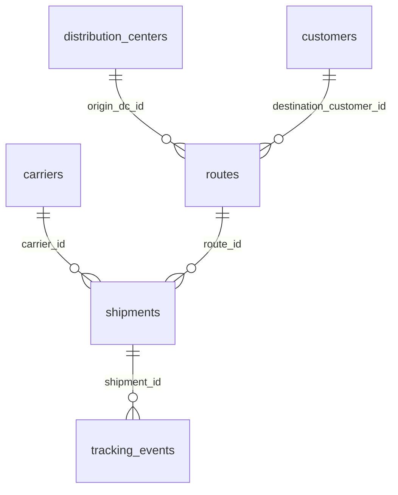

# 2. Data Structure and Relationship Schema

## Database Platform
- MySQL 8+ with SQLAlchemy and PyMySQL.
- Default database name: `scm_delivery_visibility`.

## Entities
- distribution_centers
- customers
- carriers
- routes
- shipments
- tracking_events

## Logical Relationship Schema

## Table Purpose Summary
- distribution_centers: dispatch origins and geo attributes.
- customers: destination nodes and customer segment.
- carriers: transport partner profile and reliability baseline.
- routes: lane-level distance, transit baseline, and risk category.
- shipments: operational delivery facts and cost outcomes.
- tracking_events: time-sequenced checkpoint visibility.

## Why This Structure Fits P4
- Supports full route-level and carrier-level delay diagnosis.
- Enables event-level visibility for in-transit analysis.
- Includes variables required for ML features (weather, traffic, fuel, route risk).
- Provides direct support for executive KPIs in dashboard form.

## Data Access
- Schema file: `src/database/schema.sql`
- Seeding script: `scripts/setup_db.py`
- Shared connection helper: `src/database/mysql_utils.py`

## Data Dictionary Highlights
- delay_minutes: actual minus promised timeline in minutes.
- on_time_flag: 1 if delivered on/before promised date-time else 0.
- predicted_delay_risk: probability shipment is high-risk delay.
- planned_cost vs actual_cost: detects cost overrun impact of poor visibility.
